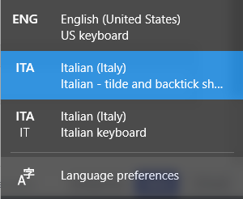

# italian-kbd-tilde-backtick
Italian keyboard layout with shortcuts for tilde (`AltGr+'`) and backtick (`AltGr+ì`)

## Installation

Unzip the [zip file](italiant.zip) and run the installer.
If the installer gets blocked by Microsoft Defender SmartScreen, right-click on the `setup.exe` file and enable the "Unblock" checkbox in the bottom right corner of `Properties → General` tab.

## Usage

In order to use the new layout:
* click on regional settings (bottom rigth, where language is displayed)
* click on `Language Preferences `
* click on `Italiano`  and select `Options `
* click on `Add a keyboard ` (you should find `Italian - tilde and backtick shortcuts` in the list)
